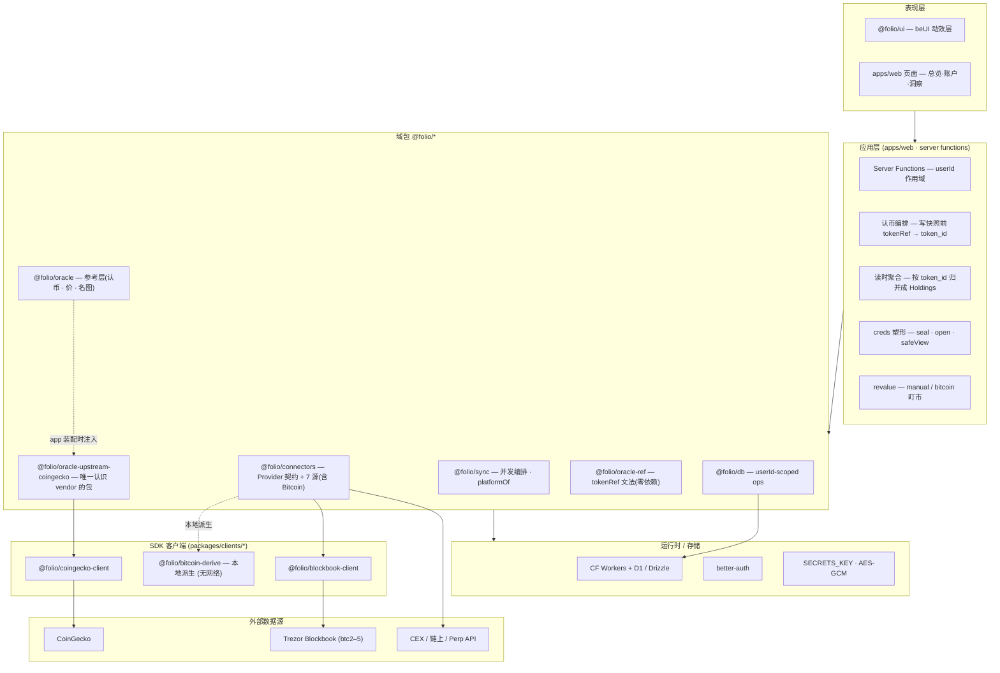

# folio 架构

> 自托管加密组合追踪器(链上钱包 + Bitcoin + CEX + Perp DEX + 手动资产 → 一个看板)。
> 本目录是**架构文档**:系统总览(本页 + `01-data-flow`)+ 子系统深讲(`02`/`03`);描述 + 关键代码 + 代码指向(`file:line`)+ 流程图。
> 权威约定见 [/CLAUDE.md](../../CLAUDE.md);难回退决策见 [docs/adr/](../adr/);路线见 [docs/roadmap.md](../roadmap.md);领域词汇见 [/CONTEXT.md](../../CONTEXT.md)。

## 文档索引

| 文档 | 类型 | 内容 |
|---|---|---|
| 本页 | 总览 | 技术栈 · 分层图 · 包清单 · 核心原则 |
| [01-data-flow.md](./01-data-flow.md) | 总览 | 两条运行时数据流:同步(写,含认币)与读(展示 + 聚合) |
| [02-canonical-aggregation.md](./02-canonical-aggregation.md) | 子系统深讲 | 一条 USDC 的完整旅程:认币(写路径)→ 聚合(读路径) |
| [03-multi-currency.md](./03-multi-currency.md) | 子系统深讲 | 多币种 FX:$880 → €809.57 的展示层换算旅程 |

## 技术栈

- **前端/全栈**:TanStack Start(`@tanstack/react-start`)+ Vite,server functions
- **运行时/存储**:Cloudflare Workers · D1(SQLite)· Drizzle ORM
- **鉴权**:better-auth(Drizzle adapter)
- **UI**:`@folio/ui` = beUI(Framer Motion)动效层 + 少量手搓原语(**零 shadcn / 零 Base UI**,见 [ADR 0004](../adr/0004-adopt-beui-motion-layer-drop-base-ui.md))
- **仓库**:pnpm workspace 单仓;TypeScript strict;Vitest;Biome

## 分层架构

## 包清单(主要 `@folio/*`,随 provider 增减)

| 包 | 路径 | 职责 |
|---|---|---|
| `@folio/web` | `apps/web` | TanStack Start 应用 + server functions |
| `@folio/ui` | `packages/ui` | beUI 动效层 + 手搓原语 |
| `@folio/sync` | `packages/sync` | 同步编排 · `platformOf`(tokenRef → 平台) |
| `@folio/connectors(-basic)` | `packages/connectors/{entry,basic}` | `BalanceProvider` 契约 + registry |
| `@folio/connectors-provider-*` | `packages/connectors/providers/*` | binance · okx · zerion · hyperliquid · coinstats · blockbook · manual |
| `@folio/oracle-ref` | `packages/oracle/ref` | `tokenRef` 文法(造串 / 拆串 / 拼回;零依赖零 IO) |
| `@folio/oracle{,-basic}` | `packages/oracle/{entry,basic}` | 参考层:认币 / 价 / 名图。**看不见任何 vendor** |
| `@folio/oracle-upstream-coingecko` | `packages/oracle/upstreams/coingecko` | 全仓唯一认识 CoinGecko 的地方 |
| `@folio/db` | `packages/db` | 封装的数据访问 op |
| `@folio/{coingecko,blockbook}-client` · `@folio/bitcoin-derive` | `packages/clients/*` | SDK 式 HTTP 客户端 · xpub 本地派生 |

## 核心原则(CLAUDE.md 1–6)

1. **契约优先** — 先定类型与 `BalanceProvider` 接口,再写实现。
2. **测试优先** — 每个 provider 对录制 fixture 做金测。
3. **模块化** — 每个 provider 独立包,经共享接口组合;取数/派生等抽成 `packages/clients/*`。
4. **`@folio/db` 只出封装 op** — 不导出 Drizzle 实例/schema。
5. **凭据永不外泄** — 只回 `safeView` + `needsCredentials`;`secret` 字段 AES-GCM。
6. **只读追踪、无签名** — 无私钥字段(Bitcoin 只收地址/xpub)。
