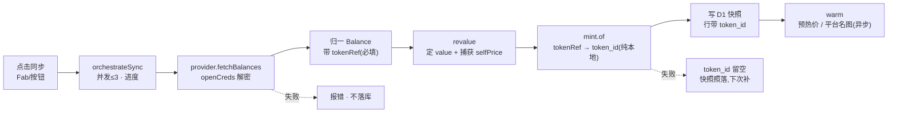
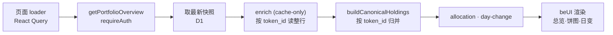

# 01 · 两条运行时数据流

folio 只有两条核心数据流,枢纽都是 **D1 快照(snapshot)**:
① **同步(写)** 各源归一成 `Balance[]` → **认币(mint)定下身份** → 落一份带 `token_id` 的快照;
② **读(展示)** 读最新快照 → 按 `token_id` 富化 → 聚合成 Holding(不缓存聚合结果)。

> **写路径定身份、读路径只认 id** —— 这是 ADR 0021 之后最重要的一条形状。
> 以前反过来:快照存 provider 原样的寻址串,「这是哪个币」在**每次读**时惰性解析。
> 动机与后果见 [ADR 0021](../adr/0021-per-user-tokens-token-id-as-sole-identity.md)。

---

## ① 同步 · 写路径

### 描述

用户点同步 → 客户端并发(≤3)逐账户调 server fn → provider 取数(此刻才解密凭据)→ 归一成带
`tokenRef` 的 `Balance[]` → **mint 把每条 ref 换成 `token_id`** → 落 D1 快照。
**失败即失败、不落库** —— 保证每份快照都是「一次完整成功的抓取」。



### 为什么 mint 在这里,而不是读的时候

**认定必须只发生一次。** 读时解析意味着同一笔持仓每次打开页面都可能得到不同答案 —— 上游改了
一条映射、缓存过期了一次,历史曲线就会在某个时间点无声地跳变。写时定死之后,认定连同金额一起
冻进快照:身份仍**可变**(事后认出来会**合并**,连历史行的 `token_id` 一并改指),但**同一份
快照读一百次答案一样**。

**mint 全程不碰网络。** 写快照是用户点了按钮在等的事,不该挂在第三方 API 上。它查本地
ref 行 → 查本地全局映射表 → 最后才按 symbol 猜(且**合约形的 ref 不许按 symbol 猜**,理由见
[02](./02-canonical-aggregation.md))。

这条是**两层保的**(#216):类型上 `MintDeps` 里没有 upstream;而 symbol 那一档要问的候选源
接的是一份**只读目录缓存** —— 有就用,多旧都用,只有完全没有时才取一次(那一次躲不掉:候选集
为空意味着所有按 symbol 认的币集体认不出来)。让目录跟上是**同步之后的后台预热**的活,一周一次。

### 关键代码

并发编排(纯函数,worker pool + 进度回调):

```ts
// apps/web/src/lib/sync-orchestrator.ts
export async function orchestrateSync(
  items, worker, { concurrency, onProgress }
) { /* 有界并发,收集 {total,done,inFlight,failures} */ }
```

provider 产出 `tokenRef`(**必填**,ADR 0020):

```ts
// packages/connectors/providers/zerion/src/index.ts
// 走 `tokenRef.contract` 而不是不透明形,是在声明「这条 ref 的 symbol 由合约部署者填、不可信」
function evmTokenRef(chainId: number, contract: string | undefined): string { /* … */ }
```

写快照前换身份(编排在 app,mint 的逻辑在 `@folio/oracle2`):

```ts
// apps/web/src/lib/server/internal/sync-deps.ts —— buildSyncDeps().writeSnapshot
const idByRef = await oracleFor(userId).mint.of(refs);   // 纯本地,一次批量点查
return db.writeSnapshot(userId, accountId, {
  ...input,
  balances: rows.map((b) => ({ ...b, tokenId: b.tokenRef ? idByRef.get(b.tokenRef) : undefined })),
});
```

**不加 barrier**:账户是并发跑的,同一条 ref 会被同时 mint,靠 store 的 upsert-then-read 幂等
收敛。搞「先统一 mint 再并发写」会牺牲「每账户独立落库、一个失败不影响其他」这条性质。

mint 失败是 best-effort:快照照落、新列留空、下次同步补上。定价/认币故障不该让一轮同步丢数据。

### 代码指向

- 客户端触发:`apps/web/src/lib/hooks/use-account-sync.ts`(SyncButton/SyncFab 复用)
- 编排:`apps/web/src/lib/sync-orchestrator.ts` `orchestrateSync`
- server fn:`apps/web/src/lib/server/sync.ts` `syncOneAccount`
- 注入式依赖装配:`apps/web/src/lib/server/internal/sync-deps.ts` `buildSyncDeps`
- 逐账户隔离与重试:`packages/sync/src/orchestrator.ts` `syncAccount`
- 凭据解密:`apps/web/src/lib/creds.ts` `openCreds`(仅此处,用完即弃)
- provider 取数契约:`packages/connectors/basic/src/provider.ts` `BalanceProvider.fetchBalances`
- 认币决策树:`packages/oracle2/entry/src/mint.ts` `createMint`
- 落库(封装 op):`packages/db/src/queries.ts` `writeSnapshot`(userId-scoped)

---

## ② 读 · 展示 + 聚合

### 描述

页面 loader → `getPortfolioOverview`(requireAuth)→ 取每账户最新快照 → **按 `token_id` 批量读整行**
(cache-only:名字 / 图 / 价)→ 组装 `AggInput` → `buildCanonicalHoldings` 归并 → 派生 allocation
(饼图)/ day-change(头部价值差)→ `@folio/ui` 渲染。**读时算,不落聚合结果**。



### 读路径不再有「解析」这一步

余额行自己带着 `token_id`,所以富化只是**按主键查表**:

```ts
// apps/web/src/lib/overview-model.ts
const enriched = await tokens.enrich(idsToEnrich);   // Map<token_id, TokenRecord>
const rows = eligible.map((x) => ({ ...x, e: recordOf(x.b) }));
```

顺带消掉一个长期隐患:以前 `enrich` 返回**同序数组**、调用方按下标配回每一行,中间任何一次
克隆或过滤都会静默错位。按 id 查表之后这个问题不存在了。

**「上游认出来了没」不是一种状态**,而是 `TokenRecord.ref` 空不空 —— 没有孤儿标记、没有复查
时刻。价是 SWR:过期不删、读出带 `stale`,展示先给旧价,客户端据 `pricesStale` 触发一次刷新;
「有身份却压根没有价」(mint 刚建的行)同样算该刷,否则首屏永远没价而且没人去取。

### 代码指向

- 读入口:`apps/web/src/lib/server/portfolio.ts` `getPortfolioOverview` / `listAccountHoldings`
- 读模型(纯,可脱离 server fn 单测):`apps/web/src/lib/overview-model.ts` `buildOverview`
- 聚合纯函数:`apps/web/src/lib/aggregate.ts` `buildCanonicalHoldings`(详见 [02](./02-canonical-aggregation.md))
- 富化助手:`apps/web/src/lib/server/internal/token-enrich.ts` `enrichBalances`
- 现推净值:`apps/web/src/lib/live-value.ts` `deriveLiveAccountTotals`(主页总价 ≡ 曲线当下点)
- 派生:`apps/web/src/lib/allocation.ts`(饼图)· `apps/web/src/lib/day-change.ts`(头部价值差)
- 渲染:`apps/web/src/routes/_authed/index.tsx`(总览)· `apps/web/src/components/token-holdings.tsx`

> **枢纽**:D1 快照。聚合规则一改,刷新即重算(读时聚合);**新增 provider 只要产出正确的
> `tokenRef`,mint 与聚合层零改动**。

---

## 手记(manual):不写快照,但走同一套身份

手记账户的「此刻」是**现造的**、不写快照
([ADR 0018](../adr/0018-manual-value-history-ledger-truth-no-snapshot.md)):持仓由
`tokens` + `manual_activity` 账本折叠出来,在读路径上注入 `byAccount`。

**但它的币跟别的来源同一套认定**([#203](https://github.com/x0finch/folio2/issues/203)):
录入时 app 造一条 ref(用户选了币 → `coingecko/<id>`,没选 → `manual/<SYMBOL>`),交给同一个
mint 换出 `token_id`。所以手记的 USDC 与链上、交易所的 USDC **落同一行** —— 聚合层不需要为它
开特例,那条「按账户 + symbol」的兜底也够不到它。

`manual` 仍然是个 connector(图标、账户表单、盯市声明都在),只是**不声明 provider** —— 它从来
不参与同步,四个值都进真表之后,原来那个 provider 只是「app 写进 JSON 列 → 再读回来」的空转。
