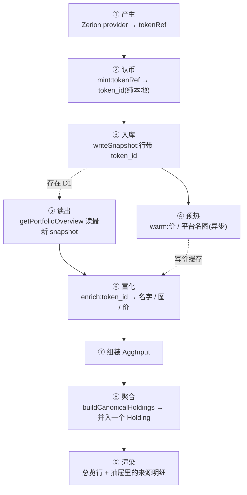

# 一条 USDC 的旅程:从 Balance Provider 到用户屏幕

> 跟着**一条具体的 USDC**走完整条流水线:它在哪里产生、出来后一站站去了哪、每站对它做了什么、
> 数据形态怎么变,直到显示给用户。
> 主角:你 Arbitrum 钱包里的一笔 USDC,由 **Zerion** provider 报出。



> ①②③④ 是**同步(写)**时发生;⑤⑥⑦⑧⑨ 是用户**打开总览(读)**时发生。中间隔着 D1 快照。
> **关键的变化(ADR 0021)**:认币在 ② 就完成了。以前它在读路径上,每次打开页面都重算一遍。

---

## ① 产生 —— Zerion 把它变成一条 `Balance`

📍 **地点**:`packages/connectors/providers/zerion/src/index.ts`(`fetchBalances`)

🔧 **做了什么**:调 Zerion API 拿到该地址的持仓;对每条,把「链 + 合约地址」编码成
`tokenRef`(`tokenRef.contract("evm:42161", "0xaf88…")`),归一成统一的 `Balance` 形状。

📦 **这条 USDC 现在长这样**:
```jsonc
{
  symbol: "USDC",
  amount: 100,
  value: 100,                                          // 美元(provider 权威)
  kind: "spot",
  tokenRef: "evm:42161/contract:0xaf88d065e7…",         // ← 链上精确寻址(Arbitrum 的 USDC 合约)
  name: "USD Coin", logo: "https://…"                  // Zerion 附带的展示信息
}
```

此刻它**只知道自己是「Arbitrum 那个合约」**,还不知道「我和以太坊 / Solana / 交易所的 USDC 是
一伙的」。

**为什么用 `contract:` 这个形状而不是随便一个不透明 id**:形状本身在声明**证据强度** ——
合约的 `symbol` 字段是部署者随手填的,不可信;原生币与场馆代号相反。② 那一步靠这个分支
([ADR 0020 第三轮](../adr/0020-token-ref-grammar.md))。

## ② 认币(mint)—— 在落库之前定下「它是哪个币」

📍 **地点**:`packages/oracle2/entry/src/mint.ts`,由 app 编排在写快照之前
(`apps/web/src/lib/server/internal/sync-deps.ts`)

🔧 **做了什么**:一批 `tokenRef` 换出各自的 `token_id`。**全程不碰网络** —— 类型上没给它
upstream(`MintDeps` 里没有那个字段),判定顺序从便宜到贵:

1. **本地已有这条 ref 的行** → 直接返回。绝大多数同步全部停在这一步。
2. **查本地全局映射表**(`global_token_ref_index`,cron 每日整份灌)→ `evm:1/contract:0xa0b8…`
   查出 `usd-coin`。
3. **按 symbol 猜** → 先查策展表,再按市值排名挑。

第 3 步的排名从 warm(市值前 1000 的目录缓存)来,而它读的是一份**只读**的:有就用、多旧都用,
只有完全没有时才取一次(#216)。让这份目录跟上是**同步之后的后台预热**的活 —— 一周一次,跑在
`waitUntil` 里。选币下拉那边读同一份 blob,但按价的新鲜度判(30min),因为用户正看着那些数字。

拿到的上游叫法就是**锚**:六个来源的 USDC 全部指向 `coingecko/usd-coin`,第一个到的建行,后面
的只加一条 ref 行 —— **多链归一就发生在这里**,不在聚合层。

📦 **形态**:这条 USDC 有了 `token_id = tk_a1b2…`(这个用户私有的 UUID)。

### ⚠️ 第 3 步有一道闸,是整条流水线最重要的一行

```ts
if (parsed.kind === "contract" || parsed.kind === "unknown") return undefined;
```

**合约不许按 symbol 猜。** 任何人都能部署一个 `symbol` 写着 `USDC` 的山寨合约;如果放它进第 3 步,
策展表会一口认下、把它并进真 USDC —— 总枚数凭空多一百万,盯市的行直接多出一百万美元,而且
**认定冻进快照、永不重判**。所以:地址查不到就老实认不出来,自己占一行。

原生币(`bitcoin/native`)与场馆代号(`binance/USDC`)相反,是放行的:原生币按设计不进全局映射表,
symbol 是它们**唯一**的一条路;场馆代号是交易所替我们审过的。

**顺序也承重**:地址那一档必须排在 symbol 前面。反过来的话,一个 symbol 写着 USDC 的山寨合约
会被 symbol 那档抢先并进真 USDC。

## ③ 入库 —— 写进一份快照

📍 **地点**:`apps/web/src/lib/server/sync.ts` → `@folio/sync` `syncAccount` → `@folio/db` `writeSnapshot`

🔧 **做了什么**:把这次抓到的**所有** Balance(含这条 USDC)连同各自的 `token_id` 打包写成一条
快照。**失败即失败、不落库**(保证快照是「完整的一次」)。

D1 没有交互式事务,mint 必须先查后写 → 它与写快照注定是两次独立的批。mint 成了而写快照失败,
只留下没人引用的 Token 行,无害,下次复用。

📦 **形态**:躺在 D1 里,带着 `token_id`。

## ④ 预热 —— 顺手把价和平台名图取好

📍 **地点**:`apps/web/src/lib/server/internal/sync-deps.ts` `warmTokensForUser`

🔧 **做了什么**:同步后台顺手刷该用户持仓币的价、汇率、链与场馆的名图,写进 per-user 缓存。
**这一步让后面的「读」可以零网络富化。**

还有一件只有它做的事(#216):**把 ② 用的那份目录刷上**,一周一次。写路径按设计永不刷,
选币下拉只在用户打开时才刷 —— 没有这一步,不开下拉的用户目录会冻在第一次同步那一刻。

注意这里**不再有「拿合约去反查上游」这回事** —— 那是旧参考层的懒解析,已随 ② 退场。

---

## ⑤ 读出 —— 用户打开总览

📍 **地点**:`apps/web/src/lib/server/portfolio.ts` `getPortfolioOverview` → `@folio/db`
`getLatestSnapshotByUser`

🔧 **做了什么**:取该用户每个账户的**最新**快照 —— 我们这条 Arbitrum USDC 重新出现,**这次它
自带 `token_id`**。

## ⑥ 富化 —— 按 id 查出名字 / 图 / 价

📍 **地点**:`apps/web/src/lib/overview-model.ts` → `tokens.enrich(ids)`(cache-only)

🔧 **做了什么**:用 ④ 缓存的结果(零网络)按 `token_id` 查出整行:`name` / `logo` /
`unitPrice` / `change24h` / `marketCapRank`。返回的是 **`Map<token_id, TokenRecord>`**,调用方查表 ——
不再是「同序数组 + 按下标配回去」那套会静默错位的写法。

📦 **形态**:身份没有变化(② 就定了),只是补上了展示字段。

## ⑦ 组装 `AggInput`

📍 **地点**:`apps/web/src/lib/overview-model.ts`

```jsonc
{ symbol:"USDC", amount:100, value:100, kind:"spot",
  tokenId:"tk_a1b2…",              // ← 归并键,来自快照行,不是富化结果反推的
  platform:"evm:42161",            // ← provider 随余额直接报(#193),不从 ref 拆
  account:{ id:"z1", label:"Wallet", connectorId:"evm" },
  name:"USD Coin", logo:"/api/logo/token/tk_a1b2…", unitPrice:1, change24h:0.01 }
```

## ⑧ 聚合 —— 和别处的 USDC 并成一条 Holding

📍 **地点**:`apps/web/src/lib/aggregate.ts` `buildCanonicalHoldings`

🔧 **做了什么**(对这条 USDC):

1. 过门槛 `isEligible`:`kind === "spot"` ✅ 进聚合。
2. 算分组键:**就是 `token_id`**。
3. 落进那个累加器:`totalValue += 100`;它自己成为**一个来源(source)**,平台读余额行报来的
   `platform` 列 → `evm:42161`。
4. 你在以太坊 / Solana / Binance / Hyperliquid 的 USDC,② 那一步已经把它们指到**同一个
   `token_id`** → 落同一个累加器 → 并成一条。

📦 **形态**:它不再是独立一行,而是 `Holding「USDC」` 里的一条 source:

```jsonc
Holding {
  key:"tk_a1b2…", token:{ id:"tk_a1b2…", symbol:"USDC", name:"USD Coin" },
  totalValue: 880,                                       // 所有来源之和
  sources:[ …, { platform:{id:"evm:42161"}, value:100 }, … ]   // ← 我们这条在这里
}
```

## ⑨ 渲染 —— 显示给用户

📍 **地点**:路由 loader `routes/_authed/index.tsx` 拿到 `holdings` →
`components/token-holdings.tsx` 渲染行 → 点击打开 `components/asset-sheet.tsx`

🔧 **做了什么**:总览列出**一行 USDC $880**(logo + symbol + 总额 + 24h);用户点开抽屉,
「各来源」里就有我们这条 **Arbitrum · $100**(以及其它来源)。

📦 **终点**:用户看到「我一共有 $880 USDC,其中 Arbitrum 上 $100」。

---

## 附:聚合的判定为什么这么设计

**1. 归并的决定权已经不在聚合层了。** ② 那一步定下 `token_id`,⑧ 只是把 id 相同的加起来。
以前聚合里有个四级回退键(`group:` → `token:` → `tk:` → `as:`),每一级都是一次「这两笔算不算
同一个」的判断;认定挪到写路径之后它塌成一级,那个函数已删。

**「永不裸 symbol」(ADR-0002)因此不再是一条要维护的规则,而是结构使然。** 唯一剩下的兜底是
「没有 `token_id` 的行按 `账户 + symbol` 各自成组」,而够得到它的只剩一类:**本列之前写下的
旧快照**(手记的持仓在 [#203](https://github.com/x0finch/folio2/issues/203) 之后也走 mint,
有自己的 `token_id`)。**兜底带账户 id**,所以它绝不会把两个账户的同名币并到一起。

**2. 展示分组(`group:`)整个退场了**(ADR 0021)。以前有一张种子名单把 `tether` + `usdt0`
归到一个「USDT 家族」,好让桥接变体并成一行。现在 WBTC 与 BTC、USDT 各桥接变体**各占一行** ——
它们确实是不同的币,合成一行是在替用户做一个他没要求的判断。

**3. 为什么读时算、不落库?** 聚合是 ⑤~⑧ 读时临时算的。聚合规则一改,刷新即重算;
**新增 provider 只要产出正确的 `tokenRef`(第 ① 站),mint 与聚合层零改动。**

**4. 身份可变、金额不变。** 一个币可能事后才被认出来(上游第二天才收录那个合约)。那时会发生
**合并**:ref 改指 + **历史快照的 `token_id` 一并改指** + 旧行删除。不改历史行的话,曲线会在
合并那一刻断成两段。金额一个字不动 —— 改的只是「这笔钱算在哪个币名下」。

---

## 代码指向速查(按旅程顺序)

| 站 | 地点 |
|---|---|
| ① 产生 | `packages/connectors/providers/zerion/src/index.ts`(文法 `packages/oracle/ref/src/token-ref.ts`) |
| ② 认币 | `packages/oracle2/entry/src/mint.ts` · 编排 `apps/web/src/lib/server/internal/sync-deps.ts` |
| ③ 入库 | `apps/web/src/lib/server/sync.ts` → `packages/db/src/queries.ts` `writeSnapshot` |
| ④ 预热 | `apps/web/src/lib/server/internal/sync-deps.ts` `warmTokensForUser` |
| ⑤ 读出 | `apps/web/src/lib/server/portfolio.ts` → `packages/db/src/queries.ts` `getLatestSnapshotByUser` |
| ⑥ 富化 | `apps/web/src/lib/overview-model.ts` · `packages/oracle2/entry/src/tokens.ts` `enrich` |
| ⑦ 组装 | `apps/web/src/lib/overview-model.ts` |
| ⑧ 聚合 | `apps/web/src/lib/aggregate.ts` `buildCanonicalHoldings`(分组键 `groupKey` / 门槛 `isEligible`) |
| ⑨ 渲染 | `apps/web/src/routes/_authed/index.tsx` · `components/token-holdings.tsx` · `components/asset-sheet.tsx` |

| 参考层的三个包 | 职责 |
|---|---|
| `packages/oracle2/basic` | 类型 + 四个端口,零逻辑;依赖表里只有文法包 |
| `packages/oracle2/entry` | 全部编排(mint / 读路径 / SWR / 缓存),**看不见任何 vendor** |
| `packages/oracle2/upstreams/coingecko` | 全仓唯一认识 CoinGecko 的地方 |

> 分层与可换源的理由见 [ADR 0023](../adr/0023-oracle-layering-swappable-source.md);
> 全局映射表见 [ADR 0022](../adr/0022-global-token-ref-index.md)。
