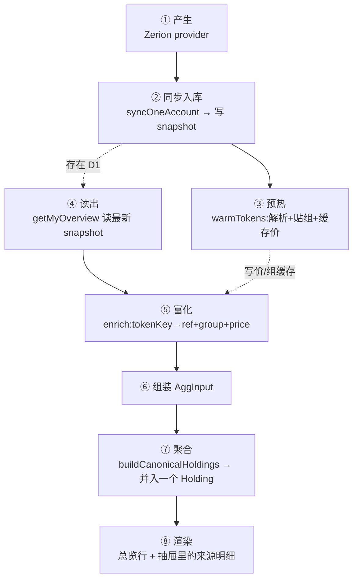

# 一条 USDC 的旅程:从 Balance Provider 到用户屏幕

> 跟着**一条具体的 USDC**走完整条流水线:它在哪里产生、出来后一站站去了哪、每站对它做了什么、数据形态怎么变,直到显示给用户。
> 主角:你 Arbitrum 钱包里的一笔 USDC,由 **Zerion** provider 报出。



> ①②③ 是**同步(写)**时发生;④⑤⑥⑦⑧ 是用户**打开总览(读)**时发生。中间隔着 D1 快照。

---

## ① 产生 —— Zerion 把它变成一条 `Balance`

📍 **地点**:`packages/balances/providers/zerion/src/index.ts`(`fetchBalances`)

🔧 **做了什么**:调 Zerion API 拿到该地址的持仓;对每条,把"链 + 合约地址"编码成 `tokenKey`(`buildTokenKey({ chainId, contract, … })`),归一成统一的 `Balance` 形状。

📦 **这条 USDC 现在长这样**:
```jsonc
{
  symbol: "USDC",
  amount: 100,
  value: 100,                                // 美元(provider 权威)
  kind: "spot",
  tokenKey: "eip155:42161/erc20:0xaf88…",    // ← 链上精确身份(Arbitrum 的 USDC 合约)
  name: "USD Coin", logo: "https://…"        // Zerion 附带的展示信息
}
```
此刻它**只知道自己是"Arbitrum 那个合约"**,还不知道"我和以太坊/Solana/交易所的 USDC 是一伙的"。

## ② 同步入库 —— 写进一份快照

📍 **地点**:`apps/web/src/lib/server/sync.ts`(`syncOneAccount`)→ `@folio/sync` `syncAccount` → `@folio/db` `writeSnapshot`(`packages/db/src/queries.ts:298`)

🔧 **做了什么**:server fn 取出账户 + 解密凭据 → 让 provider 抓取 → 把这次抓到的**所有** Balance(含这条 USDC)打包,`writeSnapshot` 存成一条快照行(balances 序列化在内)。**失败即失败、不落库**(保证快照是"完整的一次")。

📦 **形态**:这条 USDC 原样躺在 D1 的某条 snapshot 里,还是 ① 的样子。

## ③ 预热 —— 顺手把"它是谁"查好、缓存起来

📍 **地点**:`apps/web/src/lib/server/tokens.ts`(`warmTokensForUser` / `warmTokens`)→ `@folio/tokens` → `@folio/db` token-store

🔧 **做了什么**:同步后台顺手拿 `tokenKey` 里的合约去 CoinGecko 查,得到规范币 id `usd-coin`,并按种子表 `GROUP_MEMBERSHIP["usd-coin"] = "usdc"` 记下它属于 `usdc` 组,连同价格/logo 写入 token 缓存。**这一步让后面的"读"可以零网络富化。**

---

## ④ 读出 —— 用户打开总览

📍 **地点**:`apps/web/src/lib/server/overview.ts`(`getMyOverview`)→ `@folio/db` `getLatestSnapshotByUser`(`queries.ts:348`)

🔧 **做了什么**:取该用户每个账户的**最新**快照,把里面的 Balance 全部读回来 —— 我们这条 Arbitrum USDC 重新出现。

## ⑤ 富化 —— 给它贴上"真实身份 + 组 + 价格"

📍 **地点**:`overview-model.ts:39` `tokens.enrich`(cache-only)→ token-store 读出时贴组(`token-store.ts:95`)

🔧 **做了什么**:用 ③ 缓存的结果(零网络)给这条 USDC 补上:
- `ref = coingecko:usd-coin`(它的规范身份)
- `group = { id:"usdc", displaySymbol:"USDC", name:"USD Coin" }`(它属于 USDC 家族)
- `unitPrice / change24h / logo / name`

📦 **形态**:现在它**知道自己是 usdc 家族**了 —— 这是能和别处 USDC 合并的关键。

## ⑥ 组装 `AggInput` —— 变成聚合器认识的输入

📍 **地点**:`overview-model.ts:87`

🔧 **做了什么**:把"原始 Balance + 富化结果 + 所属账户"揉成一个 `AggInput`。
```jsonc
{ symbol:"USDC", amount:100, value:100, kind:"spot",
  tokenKey:"eip155:42161/erc20:0xaf88…",
  ref:"coingecko:usd-coin", group:{id:"usdc",…},
  account:{ id:"z1", type:"onchain_evm", … } }
```

## ⑦ 聚合 —— 和别处的 USDC 并成一条 Holding

📍 **地点**:`apps/web/src/lib/aggregate.ts:99` `buildCanonicalHoldings`

🔧 **做了什么**(对这条 USDC):
1. 过门槛 `isEligible`:`kind==="spot"` ✅ 进聚合。
2. 算归并键 `holdingKey`:有 `group` → 键 = **`group:usdc`**。
3. 落进 `group:usdc` 的累加器:`totalValue += 100`;它自己成为**一个来源(source)**,平台由 `tokenKey` 前缀 `eip155:42161` 判定为 **Arbitrum**。
4. 若你在以太坊/Solana/Binance/Hyperliquid 也有 USDC,它们的键**也是** `group:usdc` → 落**同一个**累加器 → 最终并成一条。

📦 **形态**:它不再是独立一行,而是 `Holding「USDC」` 里的一条 source:
```jsonc
Holding {
  key:"group:usdc", token:{ symbol:"USDC", name:"USD Coin" },
  totalValue: 880,                          // 所有来源之和
  sources:[ …, { platform:"Arbitrum", value:100 }, … ]   // ← 我们这条在这里
}
```
> 为什么非得聚合、为什么用 `group` 而不是 symbol/ref —— 见 [附:聚合的判定为什么这么设计](#附聚合的判定为什么这么设计)。

## ⑧ 渲染 —— 显示给用户

📍 **地点**:路由 loader `routes/_authed/index.tsx` 拿到 `holdings` → `components/token-holdings.tsx` 渲染行 → 点击打开 `components/asset-sheet.tsx`

🔧 **做了什么**:总览列出**一行 USDC $880**(logo + symbol + 总额 + 24h);用户点开抽屉,「各来源」里就有我们这条 **Arbitrum · $100**(以及其它来源)。

📦 **终点**:用户看到的是"我一共有 $880 USDC,其中 Arbitrum 上 $100"。

---

## 附:聚合的判定为什么这么设计

跟着上面的旅程,⑦ 那一步藏着本项目最关键的三个决策(评审重点):

**1. 为什么要"聚合"?** ⑤ 的富化只是给每条**贴标签**(它是 usdc);不聚合的话,界面会平铺 5 行 "USDC"。⑦ 才是把"标签相同的"真正合并、求和、收集来源。**解析告诉你是不是同一个,聚合负责把是同一个的合起来。**

**2. 为什么用 `group:usdc`,不用 symbol,也不只用 CGK id?**(四级归并键,`aggregate.ts:76`)
```ts
if (row.group)    return `group:${row.group.id}`;    // ① 跨 coin id 的家族(最宽)
if (row.ref)      return `token:${refKey(row.ref)}`; // ② 同一 CGK coin id
if (row.tokenKey) return `tk:${row.tokenKey}`;       // ③ 同一精确合约
return `as:${row.account.id}:${norm(row.symbol)}`;   // ④ 账户内兜底(绝不全局裸 symbol)
```
- **不按 symbol**(ADR-0002 红线):两条不相干的币可能都叫 "FOO",按名字合 = 净值错。
- **要 group 层**(ADR-0001):CoinGecko 会把桥接币拆成多个 id(以太坊 USDT=`tether`、Arbitrum 桥接 USDT=`usdt0`)。只用 ② ref 会把 USDT 拆两条;`GROUP_MEMBERSHIP` 把 `tether`+`usdt0` 都归到 `usdt` 组才能并回一条。USDC 恰好只有一个 id,所以 ①② 效果一样。

**3. 为什么读时算、不落库?** 聚合是 ④~⑦ 读时临时算的。分组/解析规则一改,刷新即重算;**新增 provider 只要产出正确 `tokenKey`(第 ① 站),自动并入正确 Holding,聚合层零改动。**

---

## 代码指向速查(按旅程顺序)

| 站 | 地点 |
|---|---|
| ① 产生 | `packages/balances/providers/zerion/src/index.ts`(`buildTokenKey` @ `packages/tokens/basic/src/token-key.ts:32`) |
| ② 入库 | `apps/web/src/lib/server/sync.ts:31` → `packages/db/src/queries.ts:298` `writeSnapshot` |
| ③ 预热 | `apps/web/src/lib/server/tokens.ts`(`warmTokens`)+ 种子 `packages/tokens/basic/src/constants.ts:51/:62` |
| ④ 读出 | `apps/web/src/lib/server/overview.ts` → `packages/db/src/queries.ts:348` `getLatestSnapshotByUser` |
| ⑤ 富化 | `overview-model.ts:39` `tokens.enrich` + 贴组 `packages/db/src/token-store.ts:51/:95` |
| ⑥ 组装 | `apps/web/src/lib/overview-model.ts:87` |
| ⑦ 聚合 | `apps/web/src/lib/aggregate.ts:99`(键 `:76` / 门槛 `:83`) |
| ⑧ 渲染 | `apps/web/src/routes/_authed/index.tsx` · `components/token-holdings.tsx` · `components/asset-sheet.tsx` |
