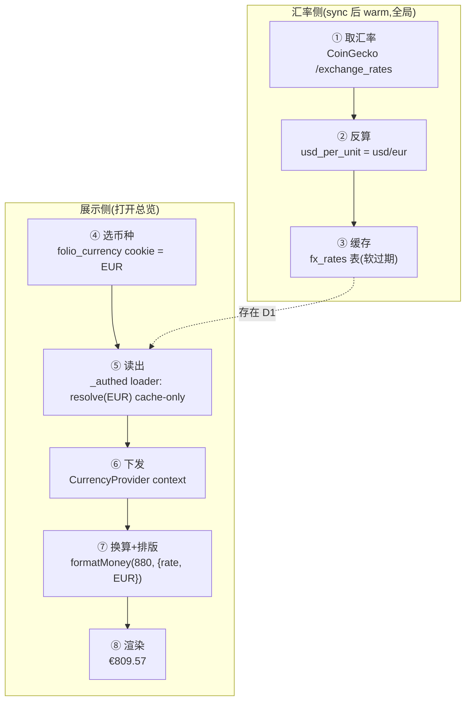

# 一个金额的旅程:$880 如何显示成 €809.57

> 跟着**组合总额 $880**走完多币种流水线:用户把展示币种切成 EUR,这 $880 一站站怎么拿到汇率、怎么换算、怎么按欧元格式排版,最终显示成 **€809.57**。
> 存储/聚合恒 USD(见 [02 一条 USDC 的旅程](02-canonical-aggregation.md)),多币种只在**展示层**发生。主角:总额 `$880`(USD)+ 偏好币种 `EUR`。



> ①②③ 是 **sync 后台**预热汇率(全局、与用户无关);④⑤⑥⑦⑧ 是用户**打开总览(读)**时发生。中间隔着 D1 的 `fx_rates` 缓存。存储值始终是 `$880`,换算只发生在 ⑦。

---

## ① 取汇率 —— 问 CoinGecko"1 BTC 值多少各币种"

📍 **地点**:`@folio/coingecko-client` `client.exchangeRates()` → `GET /exchange_rates`

🔧 **做了什么**:CoinGecko 的 `/exchange_rates` 以 **BTC 为基准单位**,一次返回所有法币/加密的汇率。

📦 **拿到的形态**:
```jsonc
{ rates: {
  btc: { value: 1,      type: "crypto" },
  usd: { value: 100000, type: "fiat" },   // 1 BTC = 100000 USD
  eur: { value: 92000,  type: "fiat" },   // 1 BTC = 92000 EUR
  eth: { value: 40,     type: "crypto" }  // 1 BTC = 40 ETH
} }
```

## ② 反算 —— 把 BTC 基准约掉,得到"每欧元几美元"

📍 **地点**:`packages/fx/src/coingecko.ts`(`createCoinGeckoFxSource.fetchRates`)

🔧 **做了什么**:对 `SUPPORTED_CURRENCIES` 每个币种算 `usd_per_unit = rates.usd.value / rates.<code>.value` —— **BTC 约掉,剩纯汇率**:
```
EUR: 100000 / 92000 ≈ 1.087   // 1 EUR = 1.087 USD
ETH: 100000 / 40    = 2500     // 1 ETH = 2500 USD(加密同理)
USD: 恒 1
```

📦 **形态**:`Map { "USD"→1, "EUR"→1.087, "ETH"→2500, … }`(code → usdPerUnit)。

## ③ 缓存 —— 写进 `fx_rates`,sync 后顺手预热

📍 **地点**:`apps/web/src/lib/server/internal/fx.ts`(`warmFx`)接在 `sync-deps` 的 `warmTokensForUser` 里 → `@folio/oracle` 的 fx 服务 `warm` → `@folio/db` `createFxStore` → `fx_rates` 表

🔧 **做了什么**:同步后台顺手刷新(任一币种缺失/过期才拉),把 usd_per_unit 连同 `expires_at`(TTL ~6h)写入 D1。**`expires_at` 只闸 warm;读时软过期**——宁可返回略旧汇率,也不掉回 USD。

📦 **形态**:D1 里一行 `{ currency:"EUR", usd_per_unit:1.087, expires_at:… }`。

---

## ④ 选币种 —— 用户把展示币种切成 EUR

📍 **地点**:`apps/web/src/components/currency-switcher.tsx`(topbar,仿 `locale-switcher`)

🔧 **做了什么**:写 `folio_currency=EUR` cookie(每浏览器,非账户级)+ `router.invalidate()` 重跑 `_authed` loader。

📦 **形态**:一个 cookie 值 `EUR`。

## ⑤ 读出 —— loader 解析币种 + cache-only 取汇率

📍 **地点**:`apps/web/src/lib/server/currency.ts`(`getDisplayCurrency`)→ `@folio/oracle` 的 fx 服务 `resolve`(读 `fx_rates`,零外部网络)

🔧 **做了什么**:读 cookie → `resolveCurrency("EUR")`(按 `SUPPORTED_CURRENCIES` 校验,未知→USD)→ `resolve("EUR")` 取 `usd_per_unit`。**缺(从未预热)→ 回退 `{USD, rate:1}`**,绝不空白/错换算。USD 早返回 `rate:1`,不查 D1。

📦 **形态**:`{ currency:{ code:"EUR", kind:"fiat" }, rate:1.087 }`。

## ⑥ 下发 —— 经 context 给整个认证区

📍 **地点**:`apps/web/src/routes/_authed.tsx`(`CurrencyProvider`)→ `usePreferCurrency`(`lib/hooks/use-prefer-currency.ts`)

🔧 **做了什么**:loader 数据塞进 `CurrencyProvider`(仿 `__root` 下发 locale/messages);组件里 `usePreferCurrency()` 同步读到 `{ currency, rate }`,无需再发请求。

## ⑦ 换算 + 排版 —— $880 → €809.57

📍 **地点**:`useDisplayValue`(`lib/hooks/use-display-value.ts`)→ `formatMoney`(`lib/format-number.ts`)

🔧 **做了什么**:`formatMoney(880, { rate:1.087, locale, currency:EUR })`:
1. **换算**:`converted = 880 / 1.087 ≈ 809.57`。
2. **按 kind 排版**:`fiat` → `Intl.NumberFormat(locale,{style:"currency",currency:"EUR"})` —— 符号/位置/小数位随币种与 locale(EUR en → `€809.57`,de → `809,57 €`;JPY 则 0 位小数)。极小值(<0.01)走 `formatTinyCurrency`(货币外壳内嵌下标)。

📦 **形态**:字符串 `"€809.57"`。
> 若切的是 **BTC**:走另一条路径——`₿` 前缀 + 高精度(`880/100000 = ₿0.0088`)。见 [附](#附为什么这么设计)。

## ⑧ 渲染 —— 显示给用户

📍 **地点**:所有金额显示点统一走 `useDisplayValue`(总额 `NumberTicker`、持仓行、抽屉来源、涨跌 `ValueChange`、图表轴/tooltip、占比饼图)

🔧 **做了什么**:总额从 `$880.00` 变 `€809.57`,全站金额一致换算;代币**数量**(`0.5 ETH`)**不换算**(走 `formatNumber`,与货币正交)。

📦 **终点**:用户看到"我的组合 ≈ €809.57"。

---

## 附:为什么这么设计

⑦ 那一步藏着本特性的关键决策(详见 [ADR 0006](../adr/0006-multi-currency-display.md)):

**1. 为什么 USD 基准 + 展示层换算?** 存储/聚合/provider 恒 USD;非美元只是渲染时 `usdValue / rate` 换一次。**不按目标币种查价**(那要把 USD 贯穿整条管线,侵入巨大);**换算只作用于最终展示值,不逐 source 换**。新增 provider 照旧只产 USD,多币种零改动。

**2. 为什么用 `/exchange_rates`(BTC 桥)?** 它专门以 BTC 为基准返回全币种,一次调用;`usd/eur` 相除时 BTC 约掉 = 纯 FX 汇率(BTC 涨跌不影响)。复用既有 CoinGecko client,零新数据源/新 key。

**3. 为什么软过期(读不硬过期)?** 展示汇率宁可旧、不可因缓存过期把金额掉回 USD。故 `resolve` 总返最近值,`expires_at` 只用来决定 warm 要不要刷。**与 `platforms` 的硬过期+否定缓存刻意不同**。

**4. 为什么 fiat / crypto 两条格式化路径?** `Intl.NumberFormat(style:"currency")` 只认 ISO 4217 → **BTC/ETH 会抛 `RangeError`**。故 fiat 走 Intl currency(随币种/ locale 正确),crypto 走 `₿`/`Ξ` 前缀 + 高精度(复用 `formatNumber`)。代币数量与货币是两套格式化:数量要精度,货币要 currency-aware。

**5. 为什么 cookie,不做 per-account?** 展示币种是每浏览器的展示偏好,和语言一样 —— 照抄现有 `folio_locale` 的 cookie 模式,零 DB、零迁移。

**6. 历史净值图怎么办?** 按**当前汇率整体换算**(不存历史汇率),图形按当前 rate 缩放,语义="此刻若换成 EUR 值多少"。逐日历史 FX 范围差一个数量级,刻意不做。

---

## 代码指向速查(按旅程顺序)

| 站 | 地点 |
|---|---|
| ① 取汇率 | `packages/clients/coingecko/src/client.ts`(`exchangeRates`)|
| ② 反算 | `packages/fx/src/coingecko.ts`(`createCoinGeckoFxSource.fetchRates`)|
| ③ 缓存/预热 | `packages/fx/src/service.ts`(`warm`,TTL)· `apps/web/src/lib/server/fx.ts`(`warmFx`)· `packages/db/src/fx-store.ts` · 表 `packages/db/src/schema.ts`(`fxRates`,迁移 `drizzle/0016_*`)|
| ④ 选币种 | `apps/web/src/components/currency-switcher.tsx` · cookie `apps/web/src/lib/currency.ts`(`CURRENCY_COOKIE`)|
| ⑤ 读出 | `apps/web/src/lib/server/currency.ts`(`getDisplayCurrency`)→ `packages/fx/src/service.ts`(`resolve`,软过期)|
| ⑥ 下发 | `apps/web/src/routes/_authed.tsx`(`CurrencyProvider`)· `apps/web/src/lib/hooks/use-prefer-currency.ts` |
| ⑦ 换算+排版 | `apps/web/src/lib/hooks/use-display-value.ts` → `apps/web/src/lib/format-number.ts`(`formatMoney` / `formatTinyCurrency`)|
| ⑧ 渲染 | `token-holdings.tsx` · `asset-sheet.tsx` · `value-change.tsx` · `portfolio-chart.tsx` · `allocation-pie.tsx`(均经 `useDisplayValue`)|
| 契约/币种表 | `packages/fx/src/types.ts`(`Currency` · `SUPPORTED_CURRENCIES`)|
