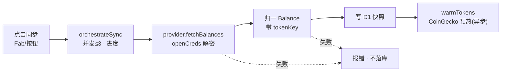
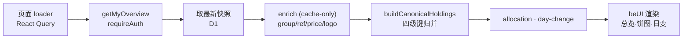

# 01 · 两条运行时数据流

folio 只有两条核心数据流,枢纽都是 **D1 快照(snapshot)**:
① **同步(写)** 把各源归一成带 `tokenKey` 的 `Balance[]` 落一份快照;
② **读(展示)** 读最新快照后**读时**才做 canonical 聚合(不缓存聚合结果)。

---

## ① 同步 · 写路径

### 描述

用户点同步 → 客户端并发(≤3)逐账户调 server fn → provider 取数(此刻才解密凭据)→ 归一成带 `tokenKey` 的 `Balance[]` → 落 D1 快照。**失败即失败、不落库**——保证每份快照都是"一次完整成功的抓取"。



### 关键代码

并发编排(纯函数,worker pool + 进度回调):

```ts
// apps/web/src/lib/sync-orchestrator.ts:18
export async function orchestrateSync(
  items, worker, { concurrency, onProgress }
) { /* 有界并发,收集 {total,done,inFlight,failures} */ }
```

provider 侧解密与取数(仅此处 `openCreds`,用完即弃):

```ts
// packages/balances/providers/hyperliquid/src/index.ts:60
const ms = state.marginSummary;
if (ms) out.push({
  symbol: MARGIN_ASSET, amount: num(ms.accountValue), value: num(ms.accountValue),
  kind: "perp", meta: { role: "equity", /* … */ },  // ← 权益行,读时判为 isMargin
});
```

### 代码指向

- 客户端触发:`apps/web/src/lib/use-account-sync.ts`(SyncButton/SyncFab 复用)
- 编排:`apps/web/src/lib/sync-orchestrator.ts:18` `orchestrateSync`
- server fn:`apps/web/src/lib/server/sync.ts:31` `syncOneAccount`
- 凭据解密:`apps/web/src/lib/creds.ts:25` `openCreds`
- provider 取数契约:`packages/balances/basic/src/provider.ts:41` `BalanceProvider.fetchBalances`
- 落库(封装 op):`packages/db/src/*`(userId-scoped;写快照 + enc creds)

---

## ② 读 · 展示 + 聚合

### 描述

页面 loader → `getMyOverview`(requireAuth)→ 取每账户最新快照 → **富化**(cache-only 解析 group/ref/价/logo)→ 组装 `AggInput` → `buildCanonicalHoldings` 归并 → 派生 allocation(饼图)/ day-change(头部价值差)→ `@folio/ui` 渲染。**读时算,不落聚合结果**。



### 关键代码

快照行 → 富化 → `AggInput` → 聚合:

```ts
// apps/web/src/lib/server/overview.ts:61
const enriched = await tokens.enrich(eligible.map((x) => x.asset));
const aggInputs: AggInput[] = eligible.map((x, i) => {
  const e = enriched[i];
  return {
    symbol: x.b.symbol, amount: x.b.amount, value: x.b.value,
    kind: x.b.kind, tokenKey: x.b.tokenKey,
    isMargin: x.margin,            // ← perp role=equity → true
    account: x.account,
    group: e?.group, ref: e?.ref,  // ← 富化给出的展示家族 / 规范 Token
    name: e?.name, logo: e?.logo, change24h: e?.change24h,
  };
});
const holdings = buildCanonicalHoldings(aggInputs);   // overview.ts:84
```

perp role 判定(equity 进聚合、position 排除):

```ts
// apps/web/src/lib/server/overview.ts:18
const r = (JSON.parse(metaJson) as { role?: unknown }).role;  // "equity" | "position"
```

### 代码指向

- 读时聚合入口:`apps/web/src/lib/server/overview.ts:61-84`
- 聚合纯函数:`apps/web/src/lib/aggregate.ts:127` `buildCanonicalHoldings`(详见 [02](./02-canonical-aggregation.md))
- 派生:`apps/web/src/lib/allocation.ts`(饼图)· `apps/web/src/lib/day-change.ts`(头部价值差)
- 渲染:`apps/web/src/routes/_authed/index.tsx`(总览)· `apps/web/src/components/token-holdings.tsx`

> **枢纽**:D1 快照。规则/种子一改,刷新即重算(读时聚合);新增 provider 只要产出正确 `tokenKey`,聚合层零改动。
